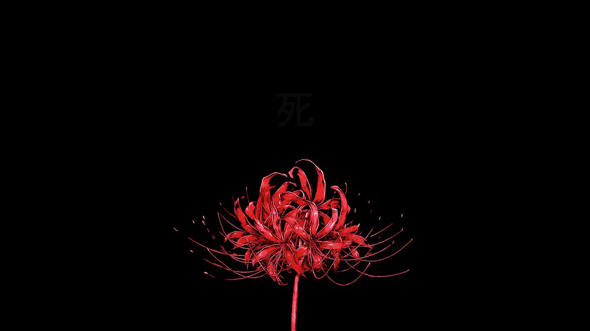

# 🖼️ All-PIC | Curated Wallpaper Collection

A personal collection of high-quality wallpapers curated for clean desktop setups, minimalist environments, and creative inspiration. 

<p align="center">
  
  
</p>

## 🌌 About the Collection
This repository is a gathered selection of visual aesthetics that I use in my daily workflows. As someone passionate about **Linux Ricing** and **System Aesthetics**, I believe the right background is the foundation of a great workspace.

### 🎨 Themes & Styles
- **Minimalism:** Clean lines and simple compositions.
- **Nature & Landscapes:** Atmospheric and high-contrast views.
- **Tech & Cyberpunk:** Dark-themed and futuristic visuals.
- **Gruvbox & Retro:** Wallpapers that complement warm, earthy color palettes.

---

## 🚀 Usage & Setup
You can use these wallpapers for your desktop environments (Hyprland, i3wm, GNOME, etc.) or mobile devices.

  **Clone the collection:**
   ```bash
   git clone [https://github.com/bilalElGohary/All-PIC.git](https://github.com/bilalElGohary/All-PIC.git)
